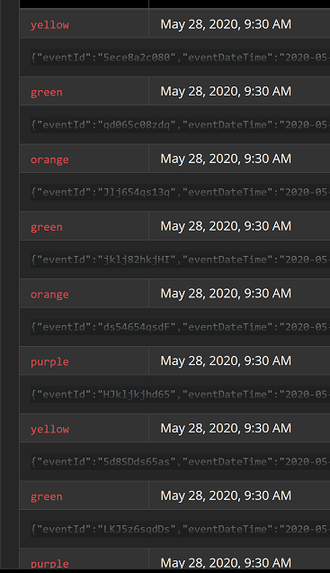

# Détection des abandonnistes


## Préambule


> **Abandonniste**. En marketing, le terme désigne un acheteur potentiel qui abandonne/quitte le processus d'achat dans lequel il était engagé avant la fin, et donc avant d'avoir finalisé son achat.


La question à laquelle je souhaite répondre ici est: **comment les détecter?**

La notion de temps est évidemment essentielle dans ce sujet. Quand un client entre sur un parcours métier, il va prendre plus ou moins longtemps pour aller au bout. Cela peut dépendre de tout un tas de critères (complexité du parcours, appétence du client au digital, etc. ). 

Décider de **la durée** à partir de laquelle un client doit être considéré comme abandonniste n'est donc pas une mesure universelle mais bien **une propriété métier**, initialement définie en phase de build[^1].

Une **architecture évènementielle** est à nouveau un excellent levier pour modéliser la situation d'un client abandonniste.

On peut en effet considérer que **pour chaque "acteur"** (prospect/client/etc.), l'entrée sur un parcours génère un **évènement d'entrée**, et que la conclusion d'un parcours génère à son tour un **évènement de sortie**.


**Δmax** est donc ici la **durée maximum** qu'on accorde à un utilisateur **pour finir un parcours** avant qu'il ne soit considéré comme abandonniste.

**Une des difficultés** lorsqu'on essaie de modéliser par l'informatique ce que doit être un comportement humain nominal est le traitement des cas à la marge qui génèrent ici des **faux positifs**.

*Imaginons...*

- *(cas 1) un parcours métier à base de formulaires où le retour arrière navigateur déclenche une remise à 0 des entrées de la page précédente. Si l'utilisateur doit resaisir toutes ces données ne doit-on pas remettre à 0 le chrono du Δmax?*
- *(cas 2) un utilisateur qui ferme sa page par erreur mais revient dans le parcours, comment peut-on le traiter pour qu'il ne soit pas considéré comme un abandonniste s'il finit son parcours dans les temps?*
- *(cas n) bien d'autres cas à la marge encore...*


Ainsi, il faut accepter qu'**il est compliqué de modéliser finement tous les scénarios**.

En choisissant par exemple un **Δmax assez large**, on peut imaginer se prémunir de la plupart des faux positifs du cas 1. **On perd** alors éventuellement **en réactivité** sur le traitement appliqué suite à cette alerte, mais on répond simplement au besoin à **coûts acceptables**.


## Proof Of Concept

### Introduction


Dans le cadre de ce travail de recherche, je vais imaginer un **parcours métier complexe** à plusieurs étapes.

La **première étape** lancera le chronomètre du Δmax en envoyant un **évènement start**. La **sortie du parcours** déclenchera un **évènement stop**. Pour ajouter un peu de "réalité opérationnelle", je vais simuler des "**retours-arrière**" parcours où certaines étapes critiques peuvent réinitialiser le chrono du Δmax en déclenchant elles-mêmes un **évènement start**.


**Kafka Stream** propose différentes façons de modéliser des évènements dans le temps. L'une de ces façons nous inspire ici, puisqu'elle représente assez bien la notion d'activité dans un parcours utilisateur: la **window session**


Je vais donc essayer de travailler avec cette **window session** pour construire des **agrégats pour chaque utilisateur**.


### Phase d'implémentation

#### Environnement

Par commodité, je vais entièrement travailler en local dans des containers docker.

Voilà ce dont j'ai besoin:

```bash
λ  docker-compose ps
            Name                           Command               State                        Ports
------------------------------------------------------------------------------------------------------------
abandonnistes_kafka_1           /etc/confluent/docker/run        Up      0.0.0.0:39092->39092/tcp, 0.0.0.0:9092->9092/tcp
abandonnistes_kafkahq_1         docker-entrypoint.sh ./kafkahq   Up      0.0.0.0:8080->8080/tcp
abandonnistes_ksqldb-cli_1      /bin/sh                          Up
abandonnistes_ksqldb-server_1   /usr/bin/docker/run              Up      0.0.0.0:8088->8088/tcp
abandonnistes_zookeeper_1       /etc/confluent/docker/run        Up      2181/tcp, 2888/tcp, 3888/tcp
```


J'utiliserai en complément kafkacat pour injecter mon jeu de données.


#### Design

Je vais travailler avec une **structure d'évènement simple** pour me concentrer uniquement sur la problématique des abandonnistes:

```json
{
    "eventId": "5ece8acbf9269864aea2c080",
    "eventDateTime": "2020-05-28T10:00:00.000+02:00",
    "actorId": "julien@axa.fr",
    "state": "start|stop"
}
```

Mon topic Kafka d'entrée s'appelle **userActivity**. Je choisis arbitrairement un Δmax de 5 minutes, et chaque utilisateur est représenté par une couleur dont voici la représentation dans mon jeu de données:


- Le cas jaune est intéressant puisqu'il représente un faux-positif d'abandonniste. Pour le moment, j'accepte ce faux-positif et considère qu'il est le fruit d'un Δmax mal calibré. 
- Le cas violet représente un acteur qui n'est pas revenu en arrière et qui a terminé son parcours dans les temps. Il n'est pas abandonniste.
- Le cas orange représente un acteur qui a fait un retour arrière et n'a pas terminé son parcours. Il est abandonniste.
- Le cas vert représente un acteur qui a fait un retour arrière et qui a terminé son parcours dans les temps. Il n'est pas abandonniste puisque le Δmax a été réinitialisé lors de son retour arrière.


Voilà la topologie que vais construire:


Je représente mon topic d'entrée par un stream appelé stream_userActivty. A partir de ce stream, je construis un agrégat sur le temps que j'appelle table_leaverDetection. Cet agrégat est lui-même représenté par un topic leaverDetection.


#### Construction


**Lancement** de l'environnement:

```bash
docker-compose up -d
```


J'injecte ensuite mon jeu de données avec **kafkacat**:

```bash
docker run --tty --mount type=bind,source="$(pwd)"/input,target=/input --network abandonnistes_default confluentinc/cp-kafkacat kafkacat -b kafka:39092 -t userActivity -P -l -K: /input/userActivity.json
```

> **Par bonne pratique**, j'ai déjà positionné **en amont** dans userActivity.json en **clé de message** l'actorId. Le partitionnement est déjà réalisé dans Kafka.


Dans KafkaHQ (localhost:8080), je retrouve bien mes 9 évènements correctement partitionnés mais - et c'est logique - l'heure du message kafka n'est pas l'heure du message contenue dans le json:



Evidemment, avec kafkacat j'ai tout injecté en 1 bloc, mais cette problématique est intéressante à traiter puisqu'elle reflète le scénario de la vraie vie où **un évènement métier peut techniquement arriver en retard**. D'où l'**intérêt** dans nos applications de streaming de travailler avec **l'heure définie dans l'objet métier**.


Lancement de la CLI ksqlDB:

```bash
docker-compose exec ksqldb-cli ksql http://ksqldb-server:8088
```


Définition de **stream_userActivity**:

```sql
CREATE STREAM stream_userActivity
(
eventId STRING,
eventDateTime STRING,
actorId STRING,
state STRING
)
WITH
(
KAFKA_TOPIC='userActivity',
VALUE_FORMAT='JSON',
TIMESTAMP='eventDateTime',
TIMESTAMP_FORMAT='yyyy-MM-dd''T''HH:mm:ss.SSSXXX'
);

 Message
----------------
 Stream created
----------------
```


Définition de mon agrégat **table_leaverDetection**:

```sql
CREATE TABLE table_leaverDetection
WITH (KAFKA_TOPIC = 'leaverDetection', VALUE_FORMAT='JSON')
AS SELECT
actorId,
TIMESTAMPTOSTRING(WINDOWSTART,'yyyy-MM-dd''T''HH:mm:ss.SSSXXX') as windowStartTime,
TIMESTAMPTOSTRING(WINDOWEND,'yyyy-MM-dd''T''HH:mm:ss.SSSXXX') as windowEndTime,
(WINDOWEND-WINDOWSTART)/1000 AS windowDurationSeconds,
LATEST_BY_OFFSET(state) AS lastState
FROM stream_userActivity
WINDOW SESSION (5 MINUTES)
GROUP BY actorId
HAVING COUNT_DISTINCT(state) = 1
EMIT CHANGES;

 Message
----------------------------------------------------
 Created query with ID CTAS_TABLE_LEAVERDETECTION_0
----------------------------------------------------
```

Si je requête ce nouveau stream:

```sql
select * from table_leaverDetection EMIT CHANGES;
+--------+---------+-----------------+-----------------+-----------------+----------+
|ROWKEY  |ACTORID  |WINDOWSTARTTIME  |WINDOWENDTIME    |WINDOWDURATIONSEC|LASTSTATE |
|        |         |                 |                 |ONDS             |          |
+--------+---------+-----------------+-----------------+-----------------+----------+
|yellow  |yellow   |2020-05-28T08:00:|2020-05-28T08:00:|0                |start     |
|        |         |00.000Z          |00.000Z          |                 |          |
|orange  |orange   |2020-05-28T08:05:|2020-05-28T08:07:|120              |start     |
|        |         |00.000Z          |00.000Z          |                 |          |
|yellow  |yellow   |2020-05-28T08:09:|2020-05-28T08:09:|0                |stop      |
|        |         |00.000Z          |00.000Z          |                 |          |

Press CTRL-C to interrupt
```


**Je retrouve donc** bien mon acteur **orange** qui est un **abandonniste**, et le **jaune** qui est un **faux positif** dont je vois bien les deux window sessions.


Imaginons que je ne souhaite pas complexifier ce stream pour détecter les faux-positifs au détriment de la réactivité du résultat, il me suffit de jouer avec mon Δmax. Exemple avec 30 minutes (requête non persistée et simplifiée):

```sql
SELECT
>actorId,
>TIMESTAMPTOSTRING(WINDOWSTART,'yyyy-MM-dd''T''HH:mm:ss.SSSXXX') as windowStartTime,
>TIMESTAMPTOSTRING(WINDOWEND,'yyyy-MM-dd''T''HH:mm:ss.SSSXXX') as windowEndTime
>FROM stream_userActivity
>WINDOW SESSION (30 MINUTES)
>GROUP BY actorId
>HAVING COUNT_DISTINCT(state) = 1
>EMIT CHANGES;
+-------------------------------+----------------------------------+----------------------------+
|ACTORID                        |WINDOWSTARTTIME                   |WINDOWENDTIME               |
+-------------------------------+----------------------------------+----------------------------+
|orange                         |2020-05-28T08:05:00.000Z          |2020-05-28T08:07:00.000Z    |

Press CTRL-C to interrupt
```

**Seul orange est encore abandonniste.** Le résultat est cohérent.


#### Perspectives

à écrire


------


[^1]: Il est également possible d'imaginer des modèles apprenants où cette durée s'ajuste par l'apprentissage des parcours qui vont au bout. Cette hypothèse n'est pas abordée ici.
